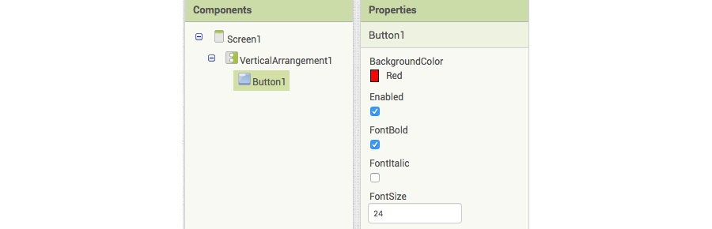

1. Go to App Inventor and select Start a new project from the Projects menu. Give your project a name.
2. In the **Palette** on the left, click **Layout** and drag a **VerticalArrangement** onto the phone screen. 
3. In the **Properties** pane on the right, click on the **Height** property, select **Fill parent** and click **OK**. Do the same for the **Width** property. 
4. Now look in the **Palette** under **User Interface** and drag a **Button** onto your **VerticalArrangement** on the phone screen.
5. Over on the right, under **Components**, click on the _VerticalArrangement1_ component. In the **Properties** pane, change the **AlignHorizontal** and **AlignVertical** both to _Center_. Do you see the button move to the middle of the phone screen?
   
6. Select _Button1_ and in the **Properties**, scroll down and change the **Text** to "Do not press". If you want, set the **BackgroundColor** and various **Font** properties too.
   
8. Change the **Height** and **Width** properties to _150 pixels_ and change the **Shape** to _oval_.
10. Click the **Add Screen** button near the top of the page. Leave the name as Screen2 and click **OK**.
11. When the new screen loads, find the **Label** component under **User Interface** in the Palette and drag it onto the screen. Under **Properties**, change the **Text** to "This app will self destruct in 5 seconds".
13. Under **Sensors** in the **Palette**, find the **Clock** and drag it onto the screen. It's an invisible component, so you won't see it on the screen! In the **Properties**, change the **TimerInterval** to _5000_.
15. Click **Blocks** in the top right. Click on _Clock1_ and take out the `When Clock1.Timer do` block. Now click **Control** under the **Built-in** blocks, grab the `close application` block and snap it into your other block.
    
17. Switch to _Screen1_ by selecting it from the button near the top.
18. Add the following blocks from **Button1** and **Control**.
    
19. Under **Built-in** select **Text** take the empty text block \(you might have to scroll up, it's at the very top\) and snap it into place. Click inside it and type "Screen2".
   
20. Your app is done! Try it out using the Emulator under **Connect** in the menu or select QR Code option under **Build** to get a link to install the app on your Android device.
 * **Note:** To install via QR Code you need to turn on "Allow installation of apps from unknown sources"
     

To learn how to make a quiz and earn yourself a digital badge, try the Beginner App Inventor Sushi Cards at dojo.soy/mini-apps-begin


