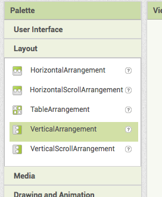
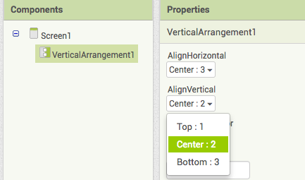

1. Go to App Inventor and select Start a new project from the Projects menu. Give your project a name.
2. In the Palette on the left, click Layout and drag a VerticalArrangement onto the phone screen. 

3. In the Properties pane on the right, change the `AlignHorizontal` and `AlignVertical` properties both to **Center**. 

4. Click on the `Height` property, select **Fill parent** and click **OK**, then do the same for the `Width` property. 

5. In the Palette, click on User Interface and drag a Button onto your VerticalArrangement on the phone screen.
6. Over on the right, under Components, click on the VerticalArrangement1 component. Then change the Properties AlignHorizontal and AlignVertical to be both have the value Center.