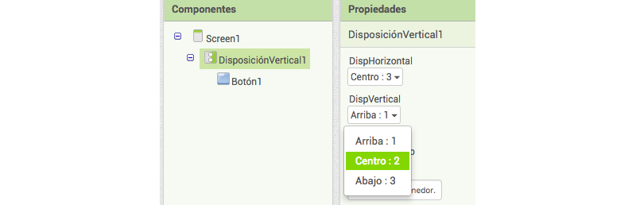

1. ¡Vas a crear una aplicación con un botón grande que, al pulsarlo, mostrará un mensaje sorpresa! Ve a App Inventor y selecciona "Start a new project" en el menú **Proyectos**. Dale un nombre a tu proyecto.

2. En **Paleta** a la izquierda, haz clic en **Disposición** y arrastra **DisposiciónVertical** a la pantalla del teléfono.
 
3. En el panel **Propiedades** de la derecha, haz clic en la propiedad **Alto**, selecciona **Ajustar al contenedor** y haz clic en **OK**. Procede del mismo modo para la propiedad **Ancho**. 

4. Ahora, vete a **Paleta** en **Interfaz de usuario** y arrastra un **Botón** en tu **DisposiciónVertical** de la pantalla del teléfono.

5. Arriba a la derecha, en **Componentes**, haz clic en el componente `VerticalArrangement1`. En el panel **Propiedades**, ajusta **DispHorizontal** y **DispVertical** en _Centro_. ¿Viste el botón moverse al medio de la pantalla del teléfono?
   
   
6. Selecciona `Botón1` y, en **Propiedades**, desplázate hacia abajo y cambia **Texto** a "Do not press". Si lo deseas, cambia también las propiedades de **ColorDeFondo** y **Texto**.
   
   
7. Cambia las propiedades de **Alto** y **Ancho** a `150` **pixels** y cambia **Forma** a **oval**.

8. Haz clic en el botón **Añadir ventana** cerca de la parte superior de la página. Deja el nombre como Screen2 y haz clic en **OK**.

9. Cuando se cargue la nueva pantalla, localiza el componente **Etiqueta** en **Interfaz de usuario** en la paleta y arrástralo a la pantalla. En **Propiedades**, cambia **Texto** a "Esta aplicación se autodestruirá en 5 segundos".

10. En **Sensores** en **Paleta**, localiza **Reloj** y arrástralo a la pantalla. Se trata de un componente invisible, por lo tanto, no lo verás en la pantalla. En **Propiedades**, cambia **IntervaloDelTemporizador** a `5000`.

11. Haz clic en **Bloques** arriba a la derecha. Haz clic en `Reloj1` y extrae el bloque `cuando Reloj1.Temporizador ejecutar`. A continuación, haz clic en **Control** en los bloques **Integrados**, agarra el bloque `cerrar la aplicación` y colócalo en el otro bloque. 
    
    
12. Accede a `Screen1` seleccionándola en el botón cerca de la parte superior.

13. Añade los siguientes bloques de **Botón1** y **Control**.
    
    
14. En **Integrados** selecciona **Texto** saca el bloque de texto vacío \(es posible que tengas que desplazarte, está arriba del todo\) y colócalo en posición. Haz clic dentro y escribe "Screen2".
   
   
15. ¡Has acabado tu aplicación! Prueba usando Emulator en **Conectar** en el menú o selecciona una opción de código QR en **Generar** para obtener un enlace para la instalación de la aplicación en tu dispositivo Android.
 * **Nota:** Para instalar mediante códigos QR, debes activar "Permitir la instalación de aplicaciones de fuentes desconocidas" en tu dispositivo Android.
     

¡Esto solamente es el comienzo! Aprende a crear un concurso de preguntas en Beginner App Inventor Sushi Cards en <b>http://dojo.soy/mini-apps-begin</b>, ¡y gana una insignia digital! Para ver esta tarjeta online o para imprimir más, visita <b>http://dojo.soy/mini-sushi-appinv</b> 


