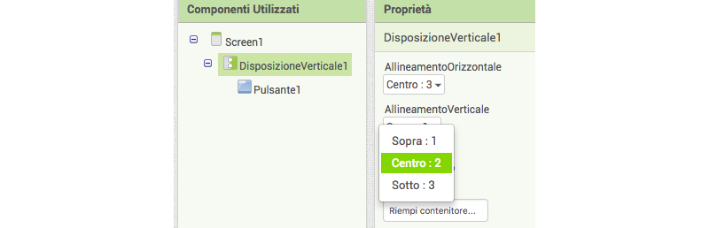
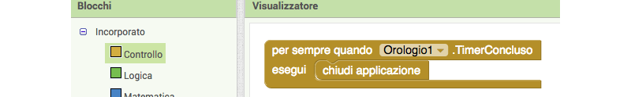

1. Realizzerai una app con un pulsante grande che, se premuto, farà apparire un messaggio a sorpresa. Vai su App Inventor e seleziona "Avvio nuovo progetto" dal menu **Progetti**. Attribuisci un nome al progetto.

2. Nella **Componenti Disponibili** a sinistra, fai clic su **Impaginazione** e trascina **DisposizioneVerticale** nella schermata del telefono.
 
3. Nel pannello **Proprietà** a destra, fai clic sulla proprietà **Altezza**, seleziona **Riempi contenitore** e fai clic su **OK**. Segui la stessa procedura per la proprietà **Larghezza**. 

4. Ora nella **Componenti Disponibili** sotto **Interfaccia utente**, trascina un **Pulsante** nella **DisposizioneVerticale** sulla schermata del telefono.

5. Sulla destra, alla voce **Componenti Utilizzati**, fai clic su `DisposizioneVerticale1`. Nel pannello **Proprietà**, modifica **AllineamentoOrizzontale** e **AllineamentoVerticale** selezionando _Centro_ per entrambi. Hai notato che il pulsante si è spostato al centro della schermata del telefono?
   
   
6. Seleziona `Pulsante1` e nelle **Proprietà**, scorri verso il basso e modifica il **Testo** digitando "Non premere". Se vuoi, puoi modificare il **ColoreSfondo** e diverse proprietà dei **Caratteri**.
   
   
7. Modifica le proprietà **Altezza** e **Larghezza** a `150` **pixel** e modifica **Sagoma** in **ovale**.

8. Fai clic sul pulsante **Aggiungi Schermo** situato sulla parte superiore della pagina. Lascia come nome Screen2 e fai clic su **OK**.

9. Al caricamento della nuova schermata, trova il componente **Etichetta** sotto **Interfaccia utente** nella Componenti Disponibili e trascinalo nella schermata. In **Proprietà**, cambia il **Testo** con "Questa app si autodistruggerà tra 5 secondi".

10. All’interno di **Sensori** nella **Componenti Disponibili**, trova **Orologio** e trascinalo nella schermata. Si tratta di un componente invisibile che non visualizzerai sullo schermo. Nelle **Proprietà**, modifica **IntervalloTimer** con `5000`.

11. Fai clic su **Blocchi** nell’angolo in alto a destra. Fai clic su `Clock1` e trascina il blocco `per sempre quanto Orologio1.TimerConcluso esegui`. Fai clic su **Controllo** dai blocchi **Incorporato**, trascina il blocco `chiudi applicazione` e inseriscilo nel blocco precedente.
    
    
12. Passa a `Screen1` selezionandolo dal relativo pulsante posizionato nella parte superiore della schermata.

13. Aggiungi i seguenti blocchi da **Pulsante1** e **Controllo**.
    
    
14. All’interno di **Incorporato**, seleziona **Testo**, trascina il blocco di testo vuoto \(scorri verso l’alto, si trova nella parte superiore\) e inseriscilo in posizione. Clicca all’interno e digita "Screen2".
   
   
15. La app è terminata! Provala usando l’Emulatore sotto **Connetti** del menu o seleziona l’opzione QR Code (Codice QR) sotto **Compila** per ottenere il link per installare la app sul tuo dispositivo Android.
 * **Nota:** Per l’installazione tramite Codice QR, dovrai attivare l’opzione "Consenti l’installazione di app da fonti sconosciute" sul tuo dispositivo Android.
     

Questo è solo l’inizio! Impara come preparare un quiz nelle Sushi Card per principianti di App Inventor all’indirizzo <b>http://dojo.soy/mini-apps-begin</b>  e guadagnati anche un adesivo digitale! Per visualizzare questa scheda online o per stamparne altre, visita <b>http://dojo.soy/mini-sushi-appinv</b> 


