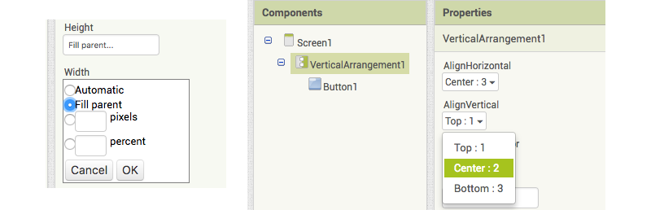

1. Realizzerai una app con un pulsante grande che, se premuto, far� apparire un messaggio a sorpresa. Vai su App Inventor e seleziona "Start a new project" (Inizia un nuovo progetto) dal menu **Projects** (Progetti). Attribuisci un nome al progetto.

2. Nella **Palette** a sinistra, fai clic su **Layout** e trascina **VerticalArrangement** (Disposizione verticale) nella schermata del telefono.
 
3. Nel pannello **Properties** (Propriet�) a destra, fai clic sulla propriet� **Height** (Altezza), seleziona **Fill parent** (Riempi colonna) e fai clic su **OK**. Segui la stessa procedura per la propriet� **Width** (Larghezza). 

4. Ora nella **Palette** sotto **User Interface** (Interfaccia utente), trascina un **Button** (Pulsante) nella **VerticalArrangement** (Disposizione verticale) sulla schermata del telefono.

5. Sulla destra, alla voce **Components** (Componenti), fai clic su `VerticalArrangement1`. Nel pannello **Properties** (Propriet�), modifica **AlignHorizontal** (Allineamento orizzontale) e **AlignVertical** (Allineamento verticale) selezionando _Center_ (Centro) per entrambi. Hai notato che il pulsante si � spostato al centro della schermata del telefono?
   
   
6. Seleziona `Button1` e nelle **Properties** (Propriet�), scorri verso il basso e modifica il **Text** (Testo) digitando "Non premere". Se vuoi, puoi modificare il **BackgroundColor** (Colore di sfondo) e diverse propriet� dei **Font** (Caratteri).
   
   
7. Modifica le propriet� **Height** (Altezza) e **Width** (Larghezza) a `150` **pixels** e modifica **Shape** (Forma) in **oval** (ovale).

8. Fai clic sul pulsante **Add Screen** (Aggiungi schermata) situato sulla parte superiore della pagina. Lascia come nome Screen2 e fai clic su **OK**.

9. Al caricamento della nuova schermata, trova il componente **Label** (Etichetta) sotto **User Interface** (Interfaccia utente) nella Palette e trascinalo nella schermata. In **Properties** (Propriet�), cambia il **Text** (Testo) con "Questa app si autodistrugger� tra 5 secondi".

10. All�interno di **Sensors** (Rilevatori) nella **Palette**, trova **Clock** (Orologio) e trascinalo nella schermata. Si tratta di un componente invisibile che non visualizzerai sullo schermo. Nelle **Properties** (Propriet�), modifica **TimerInterval** (Intervallo di tempo) con `5000`.

11. Fai clic su **Blocks** (Blocchi) nell�angolo in alto a destra. Fai clic su `Clock1` e trascina il blocco `When Clock1.Timer do`. Fai clic su **Control** (Controllo) dai blocchi **Built-in** (Integrati), trascina il blocco `close application` (chiudi applicazione) e inseriscilo nel blocco precedente.
    
    
12. Passa a `Screen1` selezionandolo dal relativo pulsante posizionato nella parte superiore della schermata.

13. Aggiungi i seguenti blocchi da **Button1** e **Control** (Controllo).
    
    
14. All�interno di **Built-in** (Integrati), seleziona **Text** (Testo), trascina il blocco di testo vuoto \(scorri verso l�alto, si trova nella parte superiore\) e inseriscilo in posizione. Clicca all�interno e digita "Screen2".
   
   
15. La app � terminata! Provala usando l�Emulator sotto **Connect** (Connetti) del menu o seleziona l�opzione QR Code (Codice QR) sotto **Build** (Costruisci) per ottenere il link per installare la app sul tuo dispositivo Android.
 * **Nota:** Per l�installazione tramite Codice QR, dovrai attivare l�opzione "Allow installation of apps from unknown sources" (Consenti l�installazione di app da fonti sconosciute) sul tuo dispositivo Android.
     

Questo � solo l�inizio! Impara come preparare un quiz nelle Sushi Card per principianti di App Inventor all�indirizzo <b>http://dojo.soy/mini-apps-begin</b> e guadagnati  anche un adesivo digitale! Per visualizzare questa scheda online o per stamparne altre, visita <b>http://dojo.soy/mini-sushi-appinv</b> 
